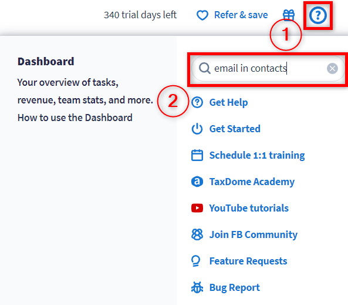
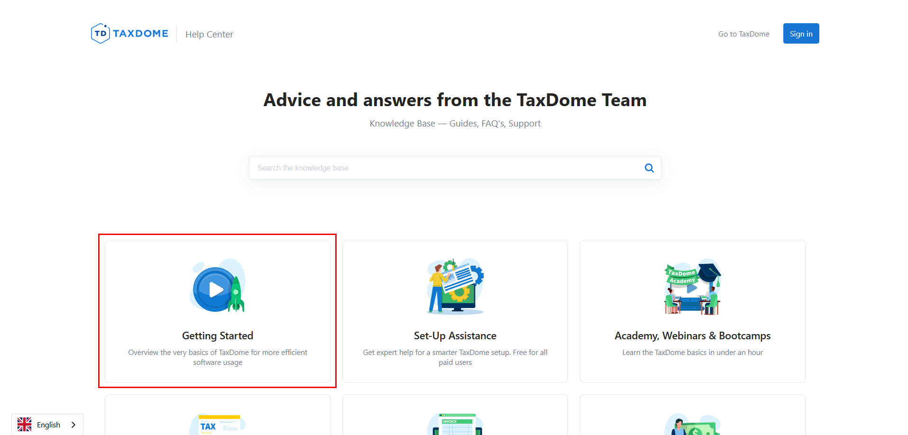
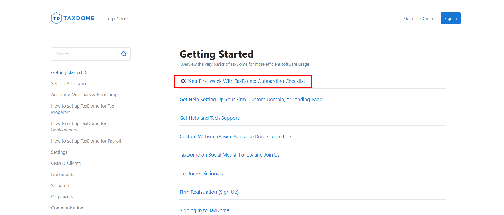
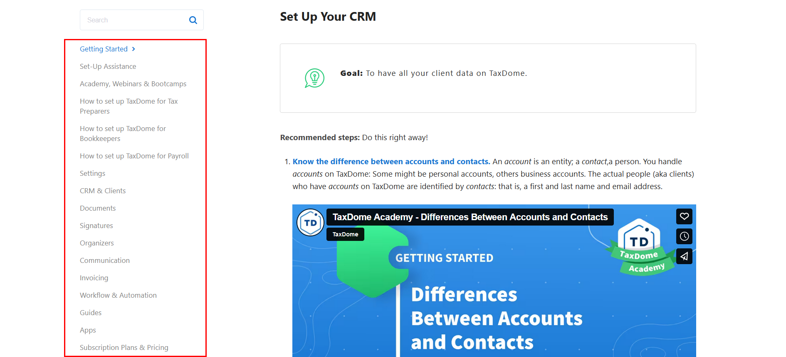
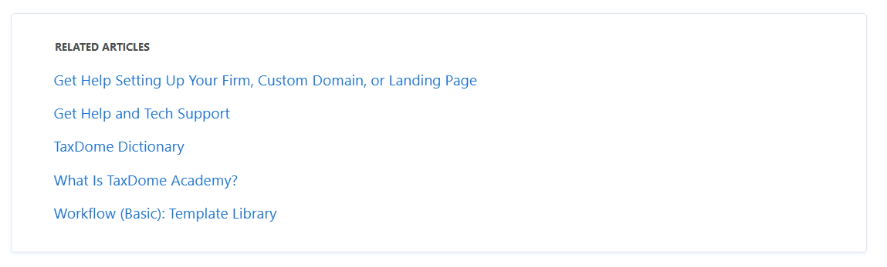
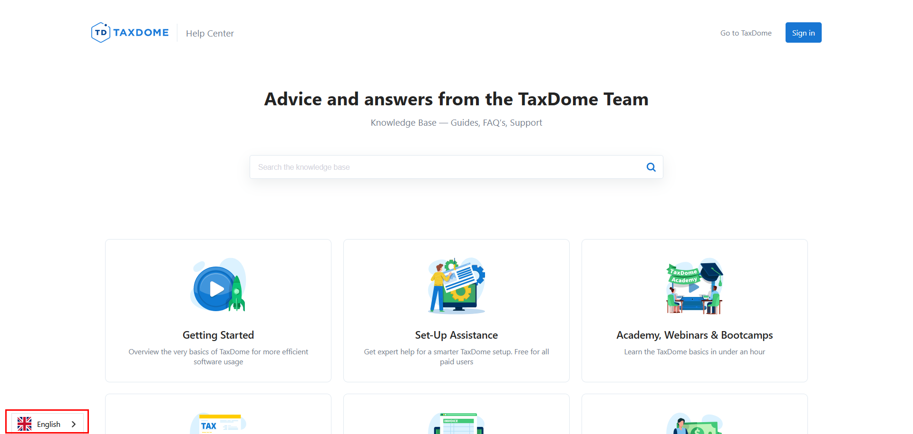

# How to Use TaxDome Help Center

Our [TaxDome Help Center](https://help.taxdome.com/) is a free knowledge base with detailed tutorials. We designed it for you to learn about TaxDome functions and find guidance whenever you need it.

What you will learn here:

* [How to access the Help Center](#accessing-the-help-center)
* [How to navigate the Help Center](#navigating-the-help-center)
* [What features are available in the Help Center](#exploring-the-help-center-features)

## Accessing the Help Center

There are three ways to access the Help Center:

* On any device, navigate to [help.taxdome.com](https://help.taxdome.com/) in your browser. You can simplify access by bookmarking the Help Center in your browser.

* On the desktop app, locate the **Help** button with a question mark in the screen's upper-right corner. Click it, enter a keyword into the search box, and choose from a list of relevant articles:

  

* On the mobile app, tap the **Help** button with a question mark in the screen's upper-right corner. Then, select the Help Center:

  

## Navigating the Help Center

We designed the Help Center to introduce specific features and guide you through common scenarios. You don't need to tackle every article at once. Instead, explore the Help Center as required. To assist you in navigating, we describe the structure of the Help Center below.

The Help Center consists of numerous categories. They are listed on the [**homepage**](https://help.taxdome.com/):

Selecting a category will take you to the list of articles on the chosen topic:

Clicking on a link in the list will take you to the corresponding article. Usually, it is a step-by-step tutorial enriched with screenshots, videos, tips, and links:

To explore a specific category, pick it up from the homepage or the **side menu**:

If you have a particular question, utilize the **search bar**. You can find it on the main page and above the side menu. Enter your keywords in the search bar and get the results:

> **💡 Tip:** You can enhance your search with quotes for precise results. For example, the query _"onboarding checklist"_ will list articles with the exact phrase.

Also, you can seamlessly navigate between articles through embedded links:

Explore the Related Articles section for a broader understanding:

## Exploring the Help Center Features

In addition to the basic Help Center functionality, we added several features to enhance your experience.

Alongside English, you can read the same Help Center articles in:

* [Danish](https://da.help.taxdome.com/)
* [Dutch](https://nl.help.taxdome.com/)
* [Finnish](https://fi.help.taxdome.com/)
* [French](https://fr.help.taxdome.com/)
* [German](https://de.help.taxdome.com/)
* [Italian](https://it.help.taxdome.com/)
* [Japanese](https://ja.help.taxdome.com/)
* [Norwegian](https://no.help.taxdome.com/)
* [Portuguese](https://pt.help.taxdome.com/)
* [Spanish](https://es.help.taxdome.com/)
* [Swedish](https://sv.help.taxdome.com/)

To switch the language, click the button in the lower-left corner of the screen:

Also, you can:

1. Provide feedback
2. Contact us for additional support
3. Check the date of the last update

To do so, find this section at the bottom of each article:

> **Related Articles**
> * [Get Help and Tech Support](https://help.taxdome.com/article/281-all-the-ways-to-get-help-and-tech-support)
